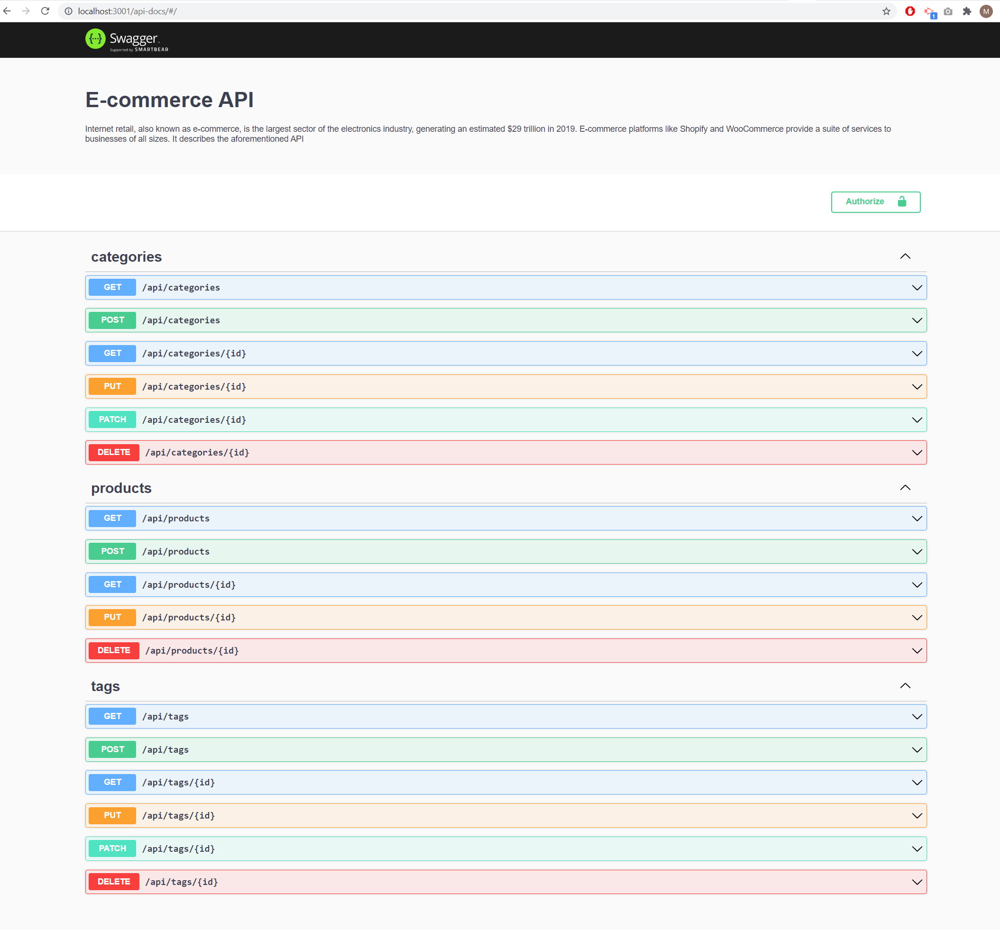
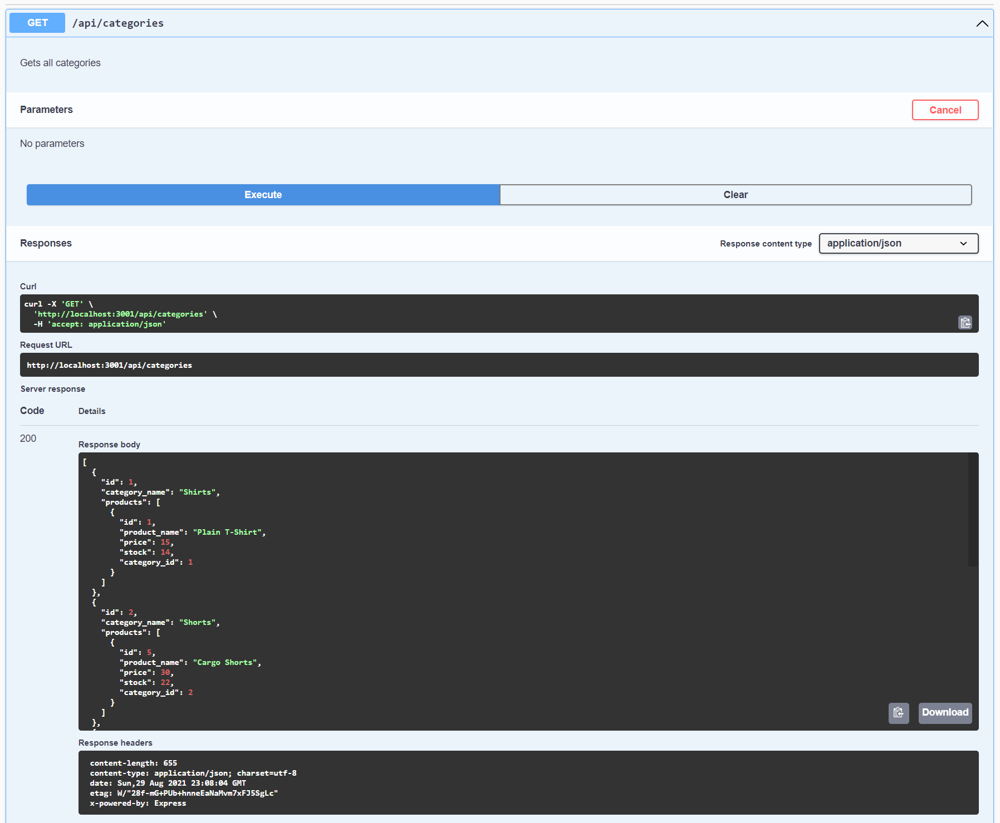
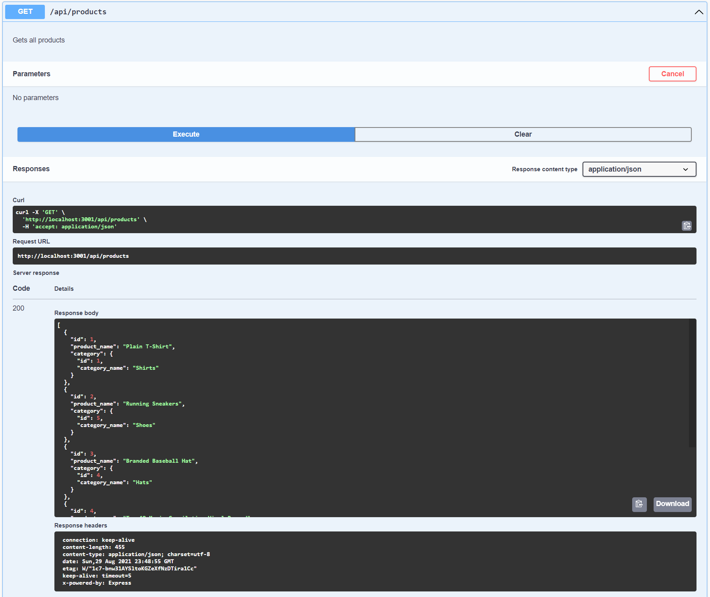
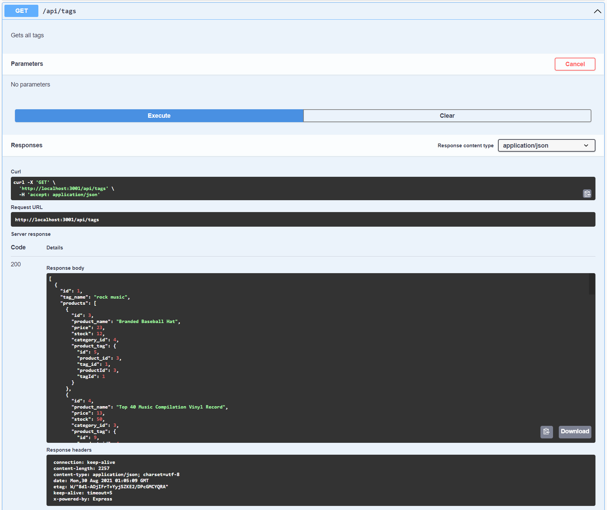
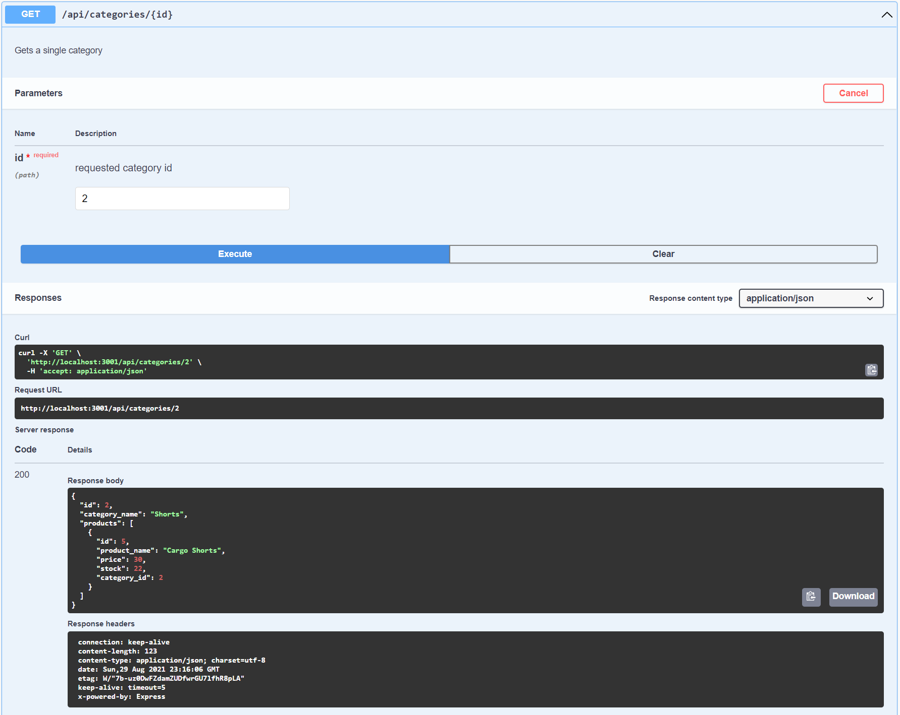
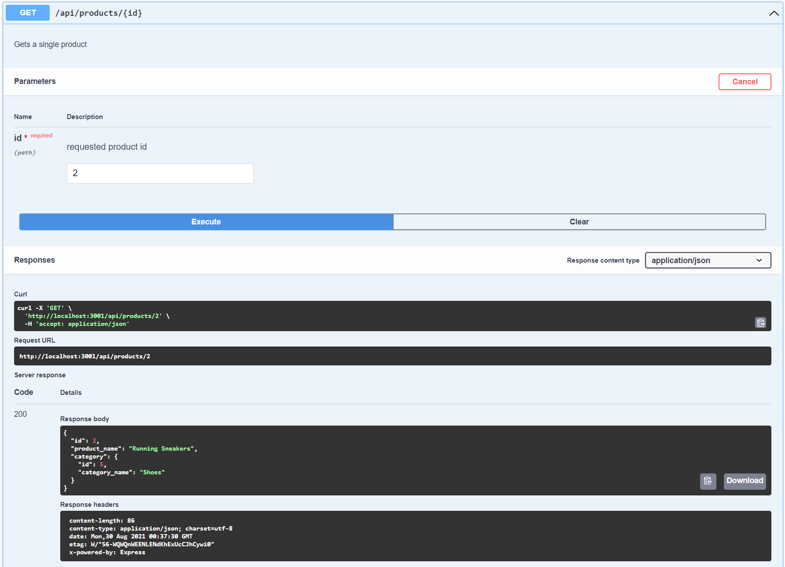
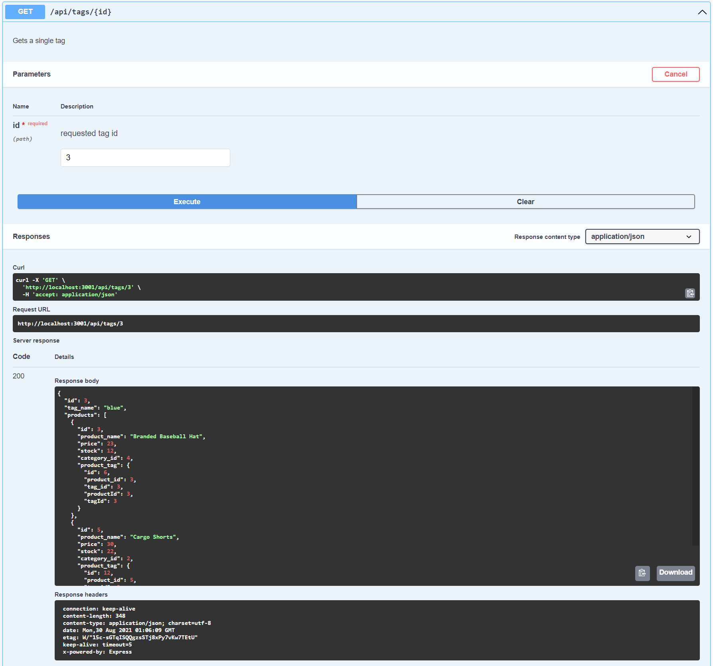

# E-Commerce Back End
Internet retail, also known as **e-commerce**, is the largest sector of the electronics industry, generating an estimated $29 trillion in 2019. E-commerce platforms like Shopify and WooCommerce provide a suite of services to businesses of all sizes. 
## About

Here is a back end for an e-commerce site. 

## User Story

```md
AS A manager at an internet retail company
I WANT a back end for my e-commerce website that uses the latest technologies
SO THAT my company can compete with other e-commerce companies
```


## Work done screenshots of the page using Swagger UI

API definitions with the visual documentation for back end implementation:

|  |
| --- | 
|  Main Page | 

| |  |  |
| --- | --- | --- |
|  Work done All Categories | Work done All Products | Work done All Tags |

| |  |  |
| --- | --- | --- |
|  Work done a single Category | Work done a single Product | Work done a single Tag |

## What's included

Configuring a working Express.js API to use Sequelize to interact with a MySQL database.

- Technologies/Frameworks/Resources:
  - Express.js API
  - Sequelize.js
  - MySQL
  - Swagger packages (swagger-jsdoc, swagger-ui-express)
  - Insomnia


## Links to Review


* The walkthrough video that demonstrates the functionality of the application (using Insomnia): https://drive.google.com/file/d/1-4BHLNf_XycBjhu7DQkZ-NIY3mZAb1PC/view

* The URL of the GitHub repository: https://github.com/MaryVPie/internet-retail-back
 

## From developer
Made with :heart: by [MaryVPie](https://github.com/MaryVPie).
I'm always happy to receive your feedback!
